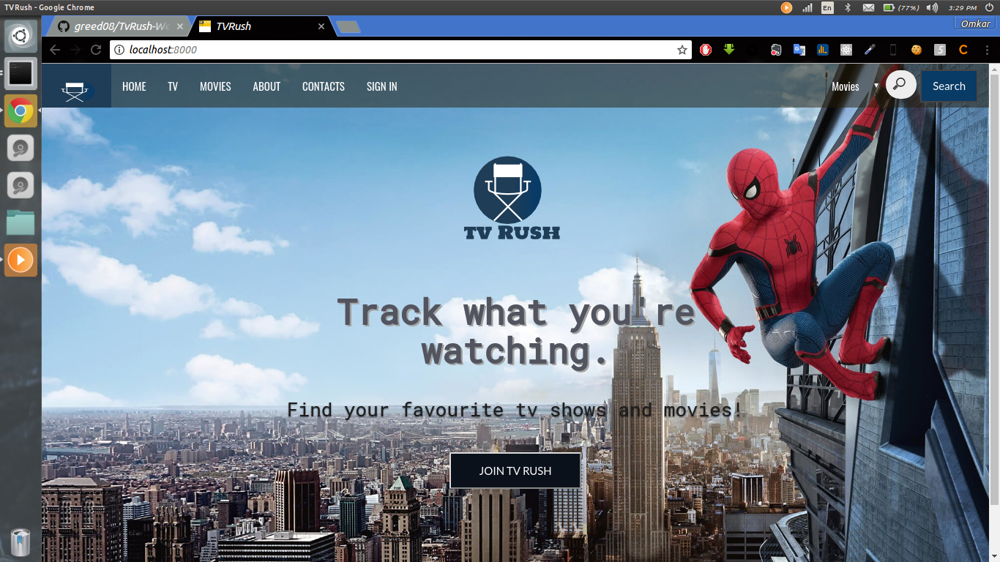
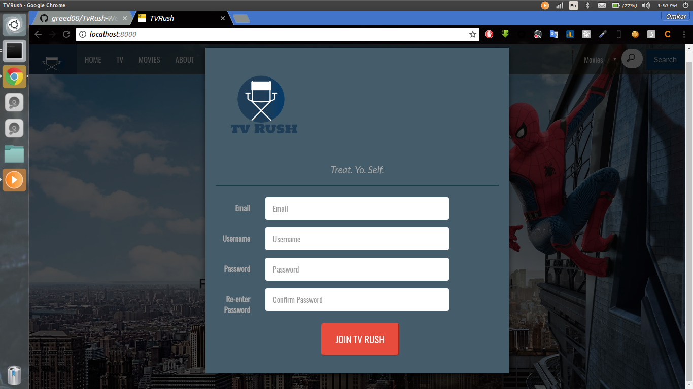
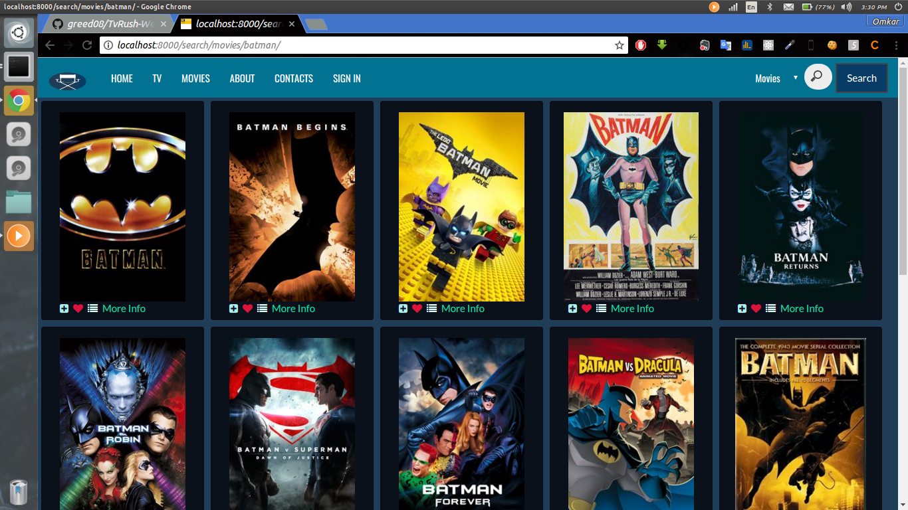
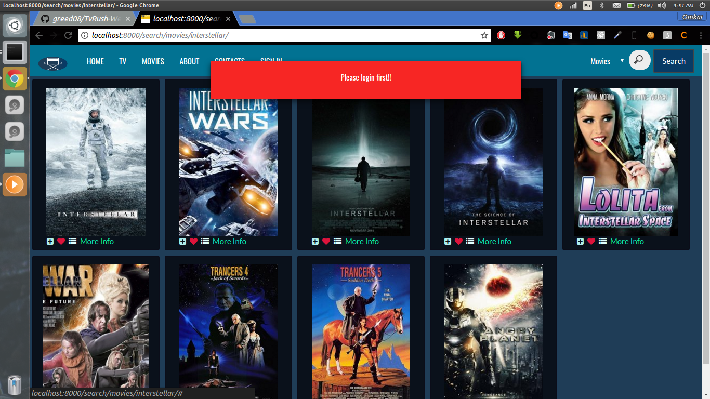
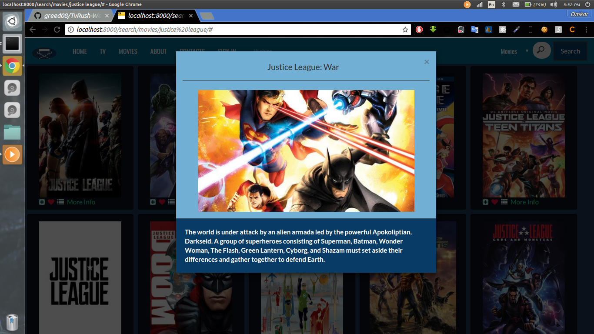
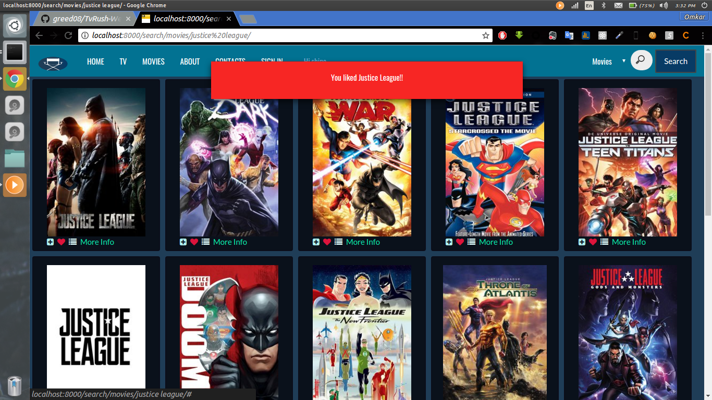

# TvRush-Web-application-using-Node-js-
A web based application where users can find their favourite tv shows and movies and add them to either of their like list,
watched history ,wishlist.Built on Node js and MongoDB .TMDB node api is used for api requests.
Here are some screenshots..

Work still in progress..
Cheers!!!
